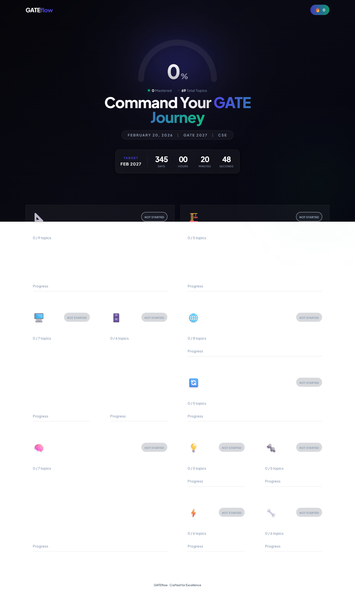

<div align="center">
  
  <h1>GATEflow</h1>
  <p><strong>Command Your GATE CSE Journey</strong></p>
  <p>A stunning, modern, and highly interactive tracking dashboard designed specifically for GATE Computer Science Engineering aspirants. Plan your study, track your progress, and stay motivated on the road to GATE 2027.</p>
</div>

---

## 🚀 Features

### **Comprehensive Syllabus Tracking**
Never lose track of what to study. The syllabus is broken down comprehensively into exactly what you need to master.
- **11 Core Subjects**: Everything from Engineering Mathematics to Computer Networks and General Aptitude.
- **Detailed Topic Breakdown**: High-level topics are divided into specific, actionable subtopics (e.g., *Discrete Mathematics > Combinatorics > Generating Functions*).
- **Subtopic Checkboxes**: Mark precise granular progress on specific concepts as you study. Track your mastery block by block.

### **Interactive Progress Visualization**
Visualize your preparation journey with a beautiful, glowing UI.
- **Global Progress Rings**: See your overall completion percentage at a glance.
- **Subject-wise Completion Bars**: Bright neon progress bars that fill up as you master subtopics.
- **Status Tags**: Topics automatically reflect states as you progress.
- **Streak Tracking**: Keep your momentum going! The built-in streak tracker encourages daily study habits.

### **Premium "Glassmorphism" Design**
Built for late-night study sessions and reducing eye strain.
- Deep dark mode aesthetics with sleek, frosted glass cards (glassmorphism).
- Vibrant, mood-enhancing gradients and neon glows that make tracking satisfying and gamified.
- Smooth animations and micro-interactions powered by Framer Motion.

---

## 📸 Screenshots

### Dashboard View
Keep an eye on the ticking countdown and your global progress across all subjects.



### Subject Detail & Subtopics
Dive into a specific subject. Expand topics to see detailed subtopics, and check them off as you prepare.


---

## 🛠️ Tech Stack

- **Frontend Framework**: [React](https://reactjs.org/) (with [Vite](https://vitejs.dev/) for lightning-fast HMR)
- **Styling**: Vanilla CSS & [Tailwind CSS](https://tailwindcss.com/) for rapid, utility-first styling and glassmorphic designs.
- **Animations**: [Framer Motion](https://www.framer.com/motion/) for fluid page transitions, expanding accordions, and dynamic UI elements.
- **Routing**: [React Router DOM](https://reactrouter.com/) for seamless single-page navigation.
- **Database/Backend**: [Supabase](https://supabase.com/) for secure user authentication and persistent cloud storage of your progress and streaks.
- **Icons**: Emoji-based and custom SVGs.

---

## 🏁 Getting Started

### Prerequisites
Make sure you have Node.js and npm installed.
You will also need a Supabase project created for the backend to handle authentication and data storage.

### Installation

1. **Clone the repository:**
   ```bash
   git clone <repository-url>
   cd GatePrep
   ```

2. **Install dependencies:**
   ```bash
   npm install
   ```

3. **Configure Environment Variables:**
   Create a `.env` file in the root directory and add your Supabase credentials:
   ```env
   VITE_SUPABASE_URL=your_supabase_project_url
   VITE_SUPABASE_ANON_KEY=your_supabase_anon_key
   ```

4. **Start the Development Server:**
   ```bash
   npm run dev
   ```

5. **Open the Application:**
   Navigate into your browser and open `http://localhost:5175`.

---

## 👨‍💻 Created for GATE Aspirants
Built to bring clarity, motivation, and a touch of premium gamification to the grueling journey of GATE CSE preparation. Keep your streak alive and track your way to a top rank!
